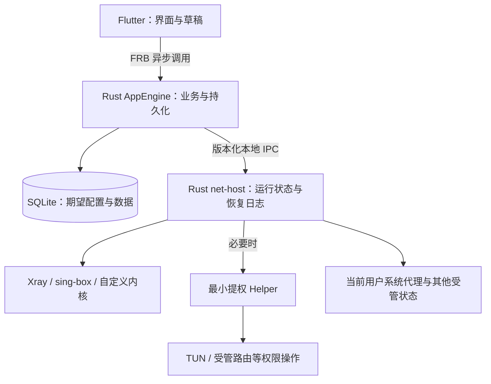

**v2rayN → Flutter 前端 + Rust 后端：完整重构实施方案**

编制日期：2026-10-01（北京时间）。这是供执行模型实施的规格与任务计划；本次只做公开源码研究和方案编写，没有实现应用、运行代理内核或修改系统网络设置。文中的性能数字是验收目标，不是实测结果。

用户已纠正技术选型：**Flutter 做前端，Rust 做应用后端。FlClash 不作为项目底座或必选依赖。**

**01．最终要交付什么**

交付一个桌面代理客户端：完整迁移冻结版本 v2rayN 在目标平台上的设置与功能，保持它的界面结构、布局模式、菜单位置、表格使用方式和操作习惯，以 Flutter 改善呈现质量，以 Rust 实现应用业务、配置处理和运行管理。

Rust 重构范围是客户端的应用层。Xray、sing-box、mihomo 以及原版支持的其他外部内核继续使用其原生可执行文件，按原版支持方式接入。不把“使用 Rust”解释成从零重写全部代理协议、TLS、QUIC 和 TUN 数据通路。真实代理流量直接经过内核，不经过 Flutter、FRB 或界面事件流。

要求的优先级固定为：功能与数据正确性 → 原版操作兼容 → 稳定和可恢复 → 可测量的性能 → 视觉精致度。改善视觉不能降低信息密度；优化性能不能删功能、改变路由结果或静默忽略字段。

本方案的“完整”有明确边界：基线版本、平台、内核版本、适用功能全部写入清单。执行模型不能用“常用功能完成”“约 95% 覆盖”“其他后续再补”宣布最终完成。

**02．冻结版本与界面基准**

截至本次核查，最新版发布是 **7.25.4，预发布版**，发布时间 2026-09-30；commit 为 `7d6a967c18c697f28dc6917122ed3a4993fcf336`。最新稳定版是 **7.24.9**。本方案按用户要求的“最新版”，采用 7.25.4 作为功能基线，7.24.9 用作稳定版配置迁移的回归样本。不能只查询 GitHub 的 latest 稳定版接口就认定已找到所有发布中最新的版本。[7.25.4 发布页](https://github.com/2dust/v2rayN/releases/tag/7.25.4)、[7.24.9 发布页](https://github.com/2dust/v2rayN/releases/tag/7.24.9)

执行时先记录本文基线；如果已经有更新发布，列出差异并建立单独升级任务。不要在一次迁移中途不断切换 master。

原版存在 Windows WPF 界面和 Avalonia Desktop 界面。本方案默认：Windows 使用 WPF 发行版作为布局与交互基准；Linux/macOS 参照相同版本 Desktop 界面及平台行为。Windows 的 Avalonia 版本用作差异核对，不能混合两套界面后宣称“一比一”。

Windows 主窗口源码默认 1200×800、最小宽度 800；主窗口包含 Horizontal、Vertical、Tab 三种布局对应的结构。最终尺寸还要核对运行时恢复逻辑、主题和 DPI，不能只看 XAML 常量。[Windows 主窗口源码](https://github.com/2dust/v2rayN/blob/7.25.4/v2rayN/v2rayN/Views/MainWindow.xaml)

先完成 Windows x64 全功能闭环，再推进 Windows ARM64、macOS 和 Linux 的平台矩阵。实施顺序不等于删除后续平台。另有真实兼容边界：原版还发布 Windows x86、Linux riscv64/loong64；Flutter 官方桌面支持矩阵不与之完全重合。若要求这些架构也完全等价，必须增加 Flutter 引擎/平台移植项目并验证，不能仅因 Rust 能编译就声称 GUI 支持。标准 Flutter 方案的发布说明必须明确这一平台差异。[v2rayN 平台矩阵](https://github.com/2dust/v2rayN/blob/7.25.4/README.md)、[Flutter 平台矩阵](https://docs.flutter.dev/reference/supported-platforms)

默认交付矩阵固定为以下六个 OS×架构单元，T00 再锁定每个单元的最低系统版本和测试系统镜像；执行模型无权自行删除单元。原版额外架构属于已知技术栈覆盖差异，不能标记为“原版不适用”。若要求连所有原版架构也完全覆盖，本方案的标准 Flutter 范围仍有待解决的引擎移植工作，不能宣布达成该更广目标。

| 默认必须交付的单元 | 界面基准 | 最低系统与测试口径 |
|---|---|---|
| Windows x64 | WPF | Windows 10/11，在锁定SDK/core允许范围内测试最低和当前系统 |
| Windows ARM64 | WPF | Windows 11 ARM64，原生DLL/插件和内核包验证 |
| macOS x64 | Avalonia Desktop | 锁定Flutter与core共同支持的最低系统及当前支持系统；关注Intel支持变化 |
| macOS ARM64 | Avalonia Desktop | 同上，使用原生ARM64依赖 |
| Linux x64 | Avalonia Desktop | 至少Ubuntu 22.04/24.04及Debian 12中的冻结测试镜像，记录glibc/桌面环境 |
| Linux ARM64 | Avalonia Desktop | 与Linux x64同样明确发行版、桌面环境和包格式，真实ARM64环境验证 |

单平台阶段版可以发布供验证，但只有六单元均通过各自适用清单，才能标记本方案的项目范围完成。发行版之外的Linux环境只说明兼容条件，不凭一次编译扩大支持承诺。

**03．必须先建立的四份清单**

在编写功能之前建立以下文件。这里给出的是后续项目中的约定文件名，不表示它们已经存在。源码索引附录只提供查找入口，不能替代逐项验证。

| 文件 | 一行代表什么 | 必须记录的内容 |
|---|---|---|
| `compat/features.yaml` | 一个独立功能 | ID、名称、平台、原版入口、源文件与符号、依赖内核、前提条件、正常/失败行为、验收用例 |
| `compat/fields.yaml` | 一个设置或持久化字段 | ID、页面/分组/顺序、类型、默认值、null/缺省/空串区别、取值范围、联动、存储键、生成配置位置、生效时机 |
| `compat/actions.yaml` | 一个用户动作 | ID、鼠标/菜单/快捷键入口、作用范围、选中规则、是否确认、取消行为、异步任务与反馈 |
| `compat/layouts.yaml` | 一个窗口/区域/布局状态 | ID、平台、布局模式、控件层级、尺寸/锚点、列顺序/列宽、滚动与分隔条、截图与 DPI |

每项还要有 `source_commit`、`implementation_location`、`test_ids`、`evidence` 和 `status`。允许的状态为 `identified / implemented / verified / preserved_only / blocked / not_applicable`。首次扫描漏项、未核实默认值另计入 `unresolved`，不能默认为不适用。

`preserved_only` 的意思是数据留住了但功能尚未实现；它不能计入完整移植。`not_applicable` 必须有上游在该平台确实不可用的依据。执行模型不能自行把难做的功能改成不适用。

扫描范围必须覆盖：两套 Views 及代码后置、ViewModels、Models、Enums、配置默认值与升级逻辑、Manager、Handler、核心配置生成器、资源模板、翻译资源、托盘与平台实现、已有测试。菜单中没有的配置字段和后台任务也必须登记。

使用 XML/C# 语法结构或可靠的项目分析工具辅助提取；正则只用于发现候选，不能因为继承、条件编译、动态菜单或嵌套字段而漏掉内容。每个 UI 绑定要能追到命令/字段，每个业务字段要有 UI、导入、内部状态或废弃字段的分类依据。

项目的完成判定由这些清单产生：目标平台适用项全部 verified，未核实项为零，阻塞和仅保留项为零。报告同时显示各类数量和证据链接，禁止只显示一个百分比。

**04．技术栈与不可混用的边界**

| 层 | 固定选择 | 责任 |
|---|---|---|
| 界面 | Flutter Desktop / Dart | 窗口、菜单、表格、表单、焦点、键盘、视觉与无障碍 |
| 界面状态 | Riverpod，一套即可 | 订阅 Rust 快照、局部刷新、表单草稿；不拥有内核运行状态 |
| 原生桥 | flutter_rust_bridge v2 | 强类型异步命令、响应和事件，不承载代理流量 |
| 应用层 | Rust + Tokio | 用例、任务调度、导入、订阅、配置生成、状态协调 |
| 数据 | SQLite + rusqlite | 单一业务写入方、版本化迁移、事务、索引与分页 |
| 网络请求 | reqwest + 已验证的 TLS 配置 | 订阅、更新、WebDAV、应用级探测；默认遵循证书验证 |
| 运行管理 | Rust `net-host` | 外部内核生命周期、运行拓扑、系统代理事务、恢复日志 |
| 提权边界 | 最小 Rust helper | 仅执行需要权限的有限平台操作 |
| 数据平面 | 原生外部内核 | 与原版相同的协议、传输、路由、DNS、TUN 实际工作 |

这些是本方案的选型，不要求套用任何其他客户端的数据库、配置格式或 IPC 协议。不要额外引入 Electron、Tauri、WebView、全套 HTTP 后端、消息代理或多套状态管理。

FRB 当前稳定版已核实为 2.13.0，2.14.0-beta.2 为预发布。建议首轮锁定 2.13.0，并让 Dart 包、Rust crate 和 codegen 同版本；首次构建确认其与选定 Flutter 的兼容性。Flutter SDK、Rust toolchain、插件和内核也锁定精确版本，提交 `pubspec.lock` 与 `Cargo.lock`。版本变更要有独立回归任务。[FRB 版本列表](https://pub.dev/packages/flutter_rust_bridge/versions)

数据库阻塞访问放在专用工作线程/受限工作池，不能把同步 SQLite 调用直接塞进异步 runtime 的工作线程长时间运行。CPU 密集解析使用受限 blocking pool；不要同时在 Dart isolate 和 Rust 重复解析同一订阅。

**05．进程结构与唯一所有者**

建议使用下面的固定结构，目的在于兼顾界面响应和 GUI 异常退出后的网络恢复。`net-host` 只在需要运行内核或改变网络设置时启动，无代理任务时可在清理后退出。



所有权必须写进代码边界：

| 数据或资源 | 唯一权威 | 其他层允许做什么 |
|---|---|---|
| 节点、订阅、规则、设置、期望使用的配置版本 | AppEngine / SQLite | UI 请求修改；net-host 不写业务数据库 |
| 正在运行的会话、PID、配置哈希、就绪与失败状态 | net-host | AppEngine 与 UI 读取快照，不自行推断 |
| 普通内核进程句柄/进程组 | net-host | Dart 禁止启动、重启或按进程名结束内核 |
| 提权启动的进程/资源句柄 | helper | net-host 通过会话租约管理，不能重复直接拥有 |
| 表单草稿、焦点、临时选中、滚动位置 | Flutter | 提交时一次发送；需要保存的 UI 偏好由 AppEngine 落库 |
| 网络修改前快照与补偿记录 | net-host，权限部分由 helper 保存 | 读取状态与发起恢复，不跨层直接改系统设置 |

必须区分 `desired_revision` 和 `applied_runtime_revision`。设置已经保存、内核尚未应用，是合法的可展示状态。不要用一个 `activeRevision` 同时代表数据库状态和运行状态，更不要声称 SQLite 事务可以把操作系统和外部进程一起原子提交。

net-host 接收不可变的 `RuntimePlan`：目标内核及版本、配置内容/受控文件引用、配置哈希、端口、依赖拓扑、所需权限和网络策略。业务数据库不复制到 net-host。大型配置在受限暂存目录中按哈希引用，禁止把任意路径直接交给提权 helper 执行。

net-host 接收后把配置和必要资源复制/固定到自己管理的私有运行目录，验证哈希、版本与路径边界，保留当前及上一份成功计划。不能依赖 GUI 随时可能删除的临时文件。含凭据的配置单独限制访问；恢复日志只记录计划标识、摘要和阶段，不把完整配置写进普通诊断日志。

Windows 使用具有明确访问控制的命名管道，Unix 使用私有运行目录中的 Unix domain socket；有协议版本、消息大小上限、会话身份和请求超时。helper 只支持有限操作枚举，不提供任意 shell 或任意管理员程序执行接口。Windows 管道显式设置 DACL，不能依赖宽泛默认权限。[Microsoft 命名管道权限](https://learn.microsoft.com/en-us/windows/win32/ipc/named-pipe-security-and-access-rights)

GUI 崩溃而 net-host 存活时，net-host 按断连策略停止受管会话并恢复属于本应用的网络修改；正常隐藏到托盘不触发该策略。若整个进程树被强杀或断电，依靠持久恢复日志在下次启动时恢复，不承诺没有存活进程时仍能即时执行清理。

本方案默认把“GUI 异常失联后恢复网络”作为增强行为，正常使用语义仍以原版为准，并在行为台账中明确记录这项异常路径差异。net-host 不能被放入随 GUI 退出而自动终止的 Job；它持有的是 core 的 Job。helper 在特权会话期间保持可用并监督 net-host，失联时清理自己拥有的特权资源，避免授权后立即退出导致后续无权回滚。

失联检测初始合同：明确的进程退出/IPC关闭立即触发核对；临时无响应采用约2秒心跳、连续3次缺失后核对进程身份与租约，再进入恢复。系统休眠/恢复必须有单独宽限和重新握手，不能把休眠误判成异常退出。T03用故障注入冻结最终超时，不让UI渲染阻塞决定租约生死。

首版不增加“关闭整个界面进程但永久后台运行”的新产品模式；如果上游基准有对应模式，再按清单移植。保持关闭按钮、隐藏到托盘、真正退出三者的原版语义。

**06．Rust 目录与 Flutter 目录约定**

以下是计划创建的项目结构；不要为每个协议创建一套重复的完整应用框架。

```text
apps/desktop/
  lib/app/                  窗口壳、主题、布局模式、国际化
  lib/features/profiles/    节点表、节点编辑与导入
  lib/features/subs/        订阅
  lib/features/routing/     路由、规则和规则资源
  lib/features/dns/         DNS
  lib/features/settings/    设置页面
  lib/features/runtime/     状态栏、代理、TUN 操作
  lib/features/monitor/     日志、连接、代理组、流量
  lib/features/backup/      迁移、备份和 WebDAV
  lib/shared/widgets/       桌面表格、表单行、菜单等
  lib/bridge/               FRB 生成物与薄适配层
  test/                     widget/golden 测试
  integration_test/         Flutter 到 Rust 的集成用例
crates/
  domain/                   纯模型、能力表、校验与错误
  application/              用例、命令、任务、revision
  persistence/              SQLite、导入与版本迁移
  subscriptions/            获取、解析、合并与调度
  config_codegen/           按内核生成配置
  core_adapters/            CLI、版本、验证、探活、统计
  runtime/                  会话拓扑、启动停止与补偿
  platform/                 代理、权限、路径与平台实现
  updater/                  下载验证、替换和回滚
  bridge_api/               FRB 公共 API
  ipc_contract/             net-host/helper 的消息协议
services/net_host/          普通权限运行管理程序
services/privileged_helper/ 必要的提权操作
compat/                    四份清单、基线、源版本锁定
fixtures/                  脱敏测试样本
tests/system/              平台与故障测试
benchmarks/                数据集、测量脚本和原始结果
docs/tasks/                小任务卡
docs/evidence/             实际运行证据
docs/decisions/            有理由和验证的架构变更
```

依赖方向是 UI → bridge → application → domain/专用模块。domain 不依赖 Flutter、窗口或平台 API。runtime 不调用 UI。平台模块不拥有订阅和节点业务。

**07．原版界面怎样保留，颜值怎样提升**

首先制作“原版布局规格”。必须包含主窗口三种布局、节点表、分组/订阅区域、日志/代理组/连接区域、底部状态栏、主题入口、托盘菜单，以及所有设置和编辑窗口。

不凭记忆画一张“顶部工具栏 + 节点列表”的示意图就开始。窗口源码要结合运行截图、持久化布局设置和用户操作录屏。首次采集使用干净测试配置，原版与新程序隔离数据目录和网络端口，避免相互接管系统代理。

布局保持项：菜单文字与层级、功能入口所在区域、默认列顺序、列宽/排序/隐藏逻辑、分隔条、Tab 的位置与顺序、默认信息密度、设置分组和字段排列、确认与取消按钮关系。三种布局都必须可用，并保存各自尺寸/分割比例。

视觉升级限定在不改变上述结构的范围：

| 项目 | 实施方式 |
|---|---|
| 字体 | 系统 UI 字体与可靠中文回退；日志/地址可用等宽字体；长文与 emoji 不截断成乱码 |
| 字号与行高 | 先测原版逻辑尺寸并锁定；不擅自把紧凑桌面表格变成触屏大行高 |
| 颜色 | 同一套浅色/深色语义 token；选中、焦点、悬停、警告与错误彼此可辨 |
| 边框与层级 | 清晰的 1 个逻辑像素分隔、适度圆角、轻量阴影；避免整窗实时模糊 |
| 图标 | 统一线宽、光学尺寸与对齐；维持原有含义及必要文字标签 |
| 动画 | 按钮/开关/浮层短反馈约 100–160ms；遵循减少动态效果；不做表格行入场动画 |
| 状态 | “连接中、已就绪、失败、恢复中”明确；颜色之外还有文字/图标 |
| 表单 | 字段标签对齐、单位清晰、就近错误；保留高级字段及原版入口 |

不强制使用 Flutter Material 默认控件尺寸。可以用 Flutter 基础控件与自定义桌面组件表达原版布局，主题 token 集中管理。不要同时混用两套完整 Material/Fluent 组件系统导致焦点、菜单和字体不一致。

节点表必须虚拟化。优先验证 Flutter 的二维滚动组件方案，或行虚拟化加共享列宽模型；选定后统一使用。必须实际支持多选、键盘、列宽拖动、排序、横向滚动和无障碍。不要把普通 DataTable 一次构建几万行再期待 Rust 弥补渲染成本。懒构建、局部刷新和减少 intrinsic layout 是 Flutter 官方建议。[Flutter 性能实践](https://docs.flutter.dev/perf/best-practices)

布局验收与皮肤验收分开：在固定 DPI/字体/窗口尺寸下比对控件锚点、顺序、大小和可见行数，关键锚点建议偏差不超过 2 个逻辑像素；颜色、抗锯齿和阴影不作为布局不一致。浅色/深色、100%/125%/150%/200% 缩放、多显示器、最大化/恢复、长文本及高对比度分别核验。

**08．操作逻辑要明确到事件级别**

不要为了“顺畅”重定义已有快捷键。例：该版本 Windows 节点表的 Ctrl+D 是编辑、Ctrl+F 是分享，Enter 是设为活动节点；双击是编辑还是激活由 `DoubleClick2Activate` 决定。菜单展示、键盘处理和设置必须相互一致。[节点表事件处理](https://github.com/2dust/v2rayN/blob/7.25.4/v2rayN/v2rayN/Views/ProfilesView.xaml.cs)

必须完成以下交互合同：

- 普通单选、Ctrl 多选、Shift 范围选择、全选、右键时保留已有多选的作用范围，逐项对照原版。
- 列排序、刷新、订阅更新、测速结果到达后按稳定节点 ID 保留选中和滚动锚点；删除后的焦点移动要确定。
- 输入框聚焦时，复制/粘贴/删除作用于文字，不误删节点；中文输入法组合输入不触发后台快捷键。
- 表单草稿与已保存数据分离。取消不落库、不重启内核；切换标签不丢草稿；保存失败保留输入和错误位置。
- 字段立即生效、保存后生效、下次启用生效分别沿用基线，不能为了方便全部变成每键保存。
- 长任务立即有可见反馈、真实阶段和取消入口；百分比未知时显示阶段，不伪造 0–100% 进度。
- 取消通过 job ID 传到 Rust；关闭弹窗或取消订阅 Stream 不代表后端任务已经取消。
- 运行相关动作串行收敛。快速点 A、B、C 节点后最终应应用 C；旧任务完成不能把 UI 改回 A。
- 任务取消只在安全点执行，已经进入操作系统变更阶段则先补偿；UI 显示“正在取消/恢复”，不能假装立即完成。
- 普通成功使用状态栏或轻量提示；错误展示可理解原因、可恢复动作和脱敏诊断入口，避免连续模态框。
- 隐藏到托盘停止无意义 UI 计时器、动画和高频刷新；代理功能持续按原设置工作。

无障碍不能最后补：每个操作有语义名称、焦点顺序、键盘路径；自绘表格单元格也必须可读取，不能只留下 Canvas 图像。

**09．必须覆盖的功能族**

下面是源码核实后的范围种子。执行模型还须按第三节扫描扩充，不能把此表当成只需完成这些“大标题”。

| 功能族 | 必須移植的行为与容易遗漏处 |
|---|---|
| 普通节点 | 增删改复制、原版实际支持的批量操作、启用、备注、分组、移动、排序、过滤、去重、无效节点清理、各列与统计 |
| 11 类基础协议 | VMess、VLESS、Shadowsocks、SOCKS、Trojan、Hysteria2、TUIC、WireGuard、HTTP、AnyTLS、Naive；表单及参数按基线逐字段移植 |
| 复合与自定义节点 | Custom、Outbound、PolicyGroup、ProxyChain；自定义配置、原生出站、策略组、代理链及引用关系 |
| 导入与导出 | 剪贴板、分享链接、批量文本、文件、图片二维码、屏幕扫码、分享二维码、导出链接/配置，格式识别与错误定位 |
| 订阅 | 全部/单组更新、直连/经代理、自动更新、User-Agent、HTTP 自定义 Header、过滤、合并/替换策略、更新失败时保留旧数据 |
| 测试 | TCP 延迟、真实延迟、UDP 测试、下载速度、混合/快速测试；并发、超时、取消、测试 URL、结果单位与排序 |
| 路由 | 基础策略、规则列表与顺序、分组、导入导出、域名/IP/端口/网络/进程等实际支持条件、内核特定规则和资源更新 |
| DNS | 简单 DNS 与原生配置、直连/代理/引导解析、hosts、FakeIP、IPv4/IPv6、阻止 AAAA、远端解析与内核差异 |
| 内核 | 选择、实际支持的下载/更新、路径、版本检查、各内核既有启动参数/配置方式、配置生成/预览/校验、启动停止重载、多进程组合 |
| 系统代理 | `ForcedClear`、`ForcedChange`、`Unchanged`、`Pac` 四种语义、绕过项、PAC 本地服务及退出恢复 |
| TUN | 开关、所选内核路径、地址、MTU、栈、路由/DNS/IPv6 和实际支持的附加项、授权、失败回滚 |
| 运行观察 | 日志、过滤/暂停/清空、流量、历史统计、Clash 兼容代理组/连接视图、组选择、断开连接 |
| 桌面 | 托盘、热键、自启、单实例、启动隐藏、关闭行为、UWP 回环设置、管理员入口、窗口和多显示器 |
| 应用管理 | 设置、主题、语言、区域预设、打开目录、更新检查、经代理检查更新、日志/临时文件清理 |
| 备份迁移 | 本地备份恢复、WebDAV、节点/设置/规则关联、自定义文件、旧配置升级、失败回滚 |
| 帮助等入口 | 原版实际显示的帮助、推广、关闭等菜单入口，也应登记，不能因非核心功能自动删除 |

协议枚举中共 15 类配置类型，含上述 11 类基础协议及 4 类自定义/复合类型。内核枚举不是“所有内核都有完整表单生成”的承诺，必须结合 Handler/Manager 的分支区分支持深度。[配置类型](https://github.com/2dust/v2rayN/blob/7.25.4/v2rayN/ServiceLib/Enums/EConfigType.cs)、[内核类型](https://github.com/2dust/v2rayN/blob/7.25.4/v2rayN/ServiceLib/Enums/ECoreType.cs)

**10．设置如何做到一个不漏**

基线 `Config` 包括：CoreBasicItem、TunModeItem、KcpItem、GrpcItem、RoutingBasicItem、GUIItem、MsgUIItem、UIItem、ConstItem、SpeedTestItem、Mux4RayItem、Mux4SboxItem、HysteriaItem、ClashUIItem、SystemProxyItem、WebDavItem、CheckUpdateItem、Fragment4RayItem、Inbound、GlobalHotkeys、CoreTypeItem、SimpleDNSItem、HappyEyeballs4RayItem，以及活动节点/分组标识。需要分别核实其中哪些属于用户设置、内部状态或兼容遗留数据。[Config](https://github.com/2dust/v2rayN/blob/7.25.4/v2rayN/ServiceLib/Models/Configs/Config.cs)、[ConfigItems](https://github.com/2dust/v2rayN/blob/7.25.4/v2rayN/ServiceLib/Models/Configs/ConfigItems.cs)

除全局设置之外，节点、订阅、DNS 配置、路由规则、模板、列配置、窗口尺寸、热键、统计都有独立数据。特别注意 Profile 的 V2→V3 `protocolExtra` 及 V3→V4 `transportExtra` 升级；只移植顶层旧字段会漏掉新参数。

每个设置的任务必须跑完这条链：

`原版字段与默认值 → Flutter 控件 → Rust 校验 → 持久化 → 重新打开读取 → 对应配置或平台行为 → 实际结果`。

字段不能只“能填写”。字段启用条件、空值语义、单位、最小/最大值、默认回填、联动和保存时机都要一样。不要通过全局 JSON 编辑框代替原有全部设置表单；原版有原生编辑器的地方才保留原生编辑器。

7.25 系列尤其要核查：sing-box v1.14 兼容及上限约束、核心设置内 Mux、通过代理检查更新、订阅自定义 HTTP Header、Xray 新格式、Clash API 调整、日志与临时文件默认清理周期。Xray 相关旧 `allowInsecure` 参数已被上游移除，不能凭旧教程把它重新写入最新生成配置。[7.25.4 变更说明](https://github.com/2dust/v2rayN/releases/tag/7.25.4)

**11．数据模型与迁移**

Rust 领域模型使用稳定 ID 和强类型字段，UI 不使用行号作为节点身份。建议实体至少包括：Profile、Subscription、RoutingProfile、RoutingRule、DnsProfile、Template、AppSettings、WindowState、CoreInstallation、TrafficStats、MigrationRecord 和 TaskRecord。

Profile 保存协议类型、协议专用参数、传输专用参数、TLS/Reality 参数、用户备注、排序键、所属订阅及引用关系。不能设计成所有协议共用一个巨大 `Map<String,String>`，也不能为了强类型而删除未知扩展。

自定义配置使用独立的 raw document 模型：原文、格式、来源版本、内核、资源基目录、允许改写的明确区域及未知扩展。原文与规范化字段分开保存。结构化更新只改自己拥有的字段；数组顺序、字符串内容、规则顺序不得随意排序。

迁移流程固定为：

1. 只读识别版本、配置目录和相关资源；报告将导入的实体与潜在缺口。
2. 取得一致性快照，记录摘要和哈希。旧程序正在写 SQLite 时使用一致性备份方式，不能只复制主数据库而遗漏 WAL。[SQLite 备份 API](https://www.sqlite.org/backup.html)
3. 导入到新应用的候选数据库，建立旧 ID → 新 ID 映射，保留原始记录。
4. 校验计数、字段、分组顺序、引用、活动节点、路径、未知项和规则语义。
5. 用冻结内核验证迁移后的候选配置；产生机器可读和用户可读的迁移报告。
6. 全部通过后提交新数据库；失败保留原数据和报告，不在原目录就地重写。

必须验证幂等：同一来源再次导入不产生意外重复，不覆盖导入后用户的新编辑。方案可使用来源 ID+来源内容哈希与导入批次记录。冲突必须可预测，不能仅凭同名节点合并。

原版引用不全是ID：某些路由 OutboundTag、订阅 PrevProfile/NextProfile 按节点 Remarks 解析；组 ChildItems 主要引用节点ID，SubChildItems还包含动态订阅选择语义。保留原引用表达式、解析类型和来源，不能全部永久转换成一个新ID。必须验证同名、改名、删除和订阅更新后仍与原版一致的解析结果。[CoreConfigContextBuilder](https://github.com/2dust/v2rayN/blob/7.25.4/v2rayN/ServiceLib/Handler/Builder/CoreConfigContextBuilder.cs)

订阅刷新同样采用候选集再提交：网络获取失败、HTTP 错误、格式错误、空结果异常都不能先删旧节点。成功删除上游已移除项的具体规则按原版设置执行；正在使用的节点被移除时按基线策略处理，并保持状态一致。

支持可移植目录与安装模式的路径规则；内核、自定义配置、规则资源可能使用相对路径。保存、备份、跨机恢复时不能把一台机器的绝对目录硬编码进所有记录。凭据与订阅地址不得出现在普通日志或测试夹具里。

**12．多内核适配与配置生成**

配置生成应是可测试的纯过程：`领域配置 + 已锁定内核能力 + 运行上下文 → 生成文件集合 + RuntimePlan + 诊断`。生成过程不顺便修改系统代理或启动进程。

每个 CoreAdapter 提供相同的高层能力，但实现按该内核定义：版本识别、能力查询、配置生成或透传、官方配置校验、命令行构造、就绪检查、统计接口、停止策略。不能把 Clash HTTP API 当成所有内核的 API，也不能把 Mihomo YAML 当成统一持久化格式。

先实现 Xray 与 sing-box 的完整结构化生成；Mihomo 及其他内核按基线的自定义配置、特殊处理和启动方式迁移。枚举中出现的 v2fly/v2fly_v5、hysteria/hysteria2、naiveproxy、tuic、juicity、brook、overtls、shadowquic、mieru 等逐一登记“可编辑类型、配置形态、启动方式、更新来源、统计支持”。`v2rayN=99` 属于应用更新标识，不应当成代理内核。

能力表至少以 `协议 × 传输 × 安全层 × 路由/DNS特性 × 内核版本 × 平台` 查询。非法组合在应用前明确阻止并指出字段，不能静默换内核、删除参数或退回不安全配置。上游支持而本实现不支持的组合记为迁移缺口。

生成器验收分三层：

- 相同输入跑原版和新实现，对输出配置做语义差分；只忽略明确的随机端口、临时路径等非语义项，不重排规则数组。
- 使用该版本内核的真实配置检查能力；没有检查命令的内核使用受控启动与退出诊断，不能伪造“检查成功”。
- 在受控本地服务/测试节点上验证路由、DNS、TCP/UDP 与连接行为。配置能解析不等于路由正确。

不只有一个全局进程，但也不能为每个代理链节点启动一个进程。分别建立 `OutboundGraph` 和 `ProcessGraph`：普通代理链优先按原版编译成同一内核内部的出站引用，例如 Xray 的 dialerProxy、sing-box 的 detour；只有实际需要TUN辅助内核、特殊前置/自定义内核时才加入进程。RuntimePlan携带最终ProcessGraph，检测环、端口冲突与悬空引用，按依赖顺序启动、反向停止。具体组合参照原版 CoreManager 和出站生成器，UI层不能临时拼接进程。

**13．启动、切换与退出的状态机**

至少定义 `Stopped → Validating → Preparing → Starting → Checking → Running`；失败进入 `RollingBack`，补偿失败进入 `Degraded`。配置与运行不一致时显示“已保存，未应用/应用失败”，而不是伪造 Running。

一轮操作携带 operation ID、session ID、generation、desired revision、配置哈希和资源所有权记录。net-host 的运行状态只由实际事件推动，UI 不能在按钮点击时自行改成“已连接”。

执行顺序：校验候选配置 → 检查版本/端口/权限 → 写入候选文件和恢复记录 → 启动依赖进程 → 确认监听及所需 API → 提交本应用需要的系统网络变更 → 完成最终健康检查 → 更新 applied runtime revision → 发布事件。

“内核本地已就绪”和“远端网络可达”分开显示；远端临时不可达不应被等价解释为本地进程未启动。需要远端探测的测试使用明确超时，不无限阻塞主窗口。

同端口或 TUN 独占场景不能保证新旧实例并存：保留旧配置，停旧，启新，失败恢复旧实例并补偿系统变更；旧实例也恢复失败则明确进入 Degraded。不承诺所有切换都零中断。

启动前查端口只能作为提示，存在检查后被占用的竞争，必须处理真正 bind 失败。停止要确认退出，超时才升级终止方式；只操作持有句柄和会话记录的进程，禁止按进程名批量杀掉其他客户端。

stdout/stderr 必须持续消费并有界处理，避免管道填满导致 core 卡住。core 意外退出、API 断开、配置提交失败必须成为结构化事件。有限重试使用退避并保留根因，不能无限重启循环。[Tokio 进程 API](https://docs.rs/tokio/latest/tokio/process/struct.Command.html)

Windows 普通子进程由 net-host 持有 Job Object 等合适的进程树约束，处理句柄继承、父进程退出和提权例外；不能把窗口隐藏误当作关闭最后一个运行句柄。[Microsoft Job Objects](https://learn.microsoft.com/en-us/windows/win32/procthread/job-objects)

系统代理恢复必须逐字段检查所有权：修改前存旧值，记录本应用写入值；恢复时当前值仍是本应用写入值才恢复。用户或其他软件改过的字段不能被无条件覆盖。TUN 路由/DNS/网卡同样只清理本应用创建或明确拥有的资源。

恢复记录可采用 Prepared / Applying / Applied / Finalized 阶段，但日志不等于系统事实。无论崩溃发生在记录前后，都要重新读取当前代理/路由/端口/进程。进程身份至少使用 PID 加创建时间/代次，防止误认复用的 PID。资源已经恢复时重复恢复应安全。

数据库和运行提交用期望/实际版本对齐，不做分布式事务：先可靠保存 desired revision，成功运行后由 net-host 记录 applied revision；重连时读取真实 applied 状态及日志再对齐。界面永远能解释“用户想要什么”和“现在实际运行什么”。

**14．前后端接口合同**

API 名称可在项目建立时统一，但语义不得省略。示例是合同草案，不是可直接编译的代码。

| API 类别 | 请求与结果的最低要求 |
|---|---|
| `get_snapshot` | 设置版本、运行快照、活动任务、能力和启动恢复状态 |
| `query_profiles` | 过滤/排序/游标/窗口大小；返回稳定 ID、必要字段、总数或后续游标 |
| `save_profile` | 编辑草稿+expected revision；返回字段错误或已保存实体与新版本 |
| `apply_runtime` | 目标配置 ID+expected revision；返回 operation ID，结果走事件 |
| `update_subscription` | 订阅范围、直连/代理策略；返回 job ID，可取消 |
| `start_test` | 节点 ID 集、测试类型、受限并发；返回 job ID与批量结果事件 |
| `save_settings` | 明确字段集合+expected revision；返回生效策略和是否需要应用 |
| `set_system_proxy` / `set_tun` | 目标模式+操作上下文；实际状态只由 net-host 回传 |
| `import_v2rayn` | 先预检、候选迁移、报告；确认应用时使用已验证的导入批次 |
| `cancel_job` | 幂等；区分已取消、正在补偿、已结束或不可立即取消 |
| `subscribe_events` | 带 epoch/seq 的事件流；断流重连可回取快照 |

上述是 AppEngine 公共 API。net-host 内部 IPC 保持小接口：GetSnapshot、ApplyPlan、StopRuntime、GetOperation、SubscribeEvents、Shutdown，以及需要真实临时 core 的受限测试会话操作。代理/TUN变更最终合成为一个运行计划，避免多个不受协调的独立写入口。仅一个 RuntimeClient 可以连接 net-host；断连后先按 operation ID 查询实际结果，再决定是否重试。

统一错误模型：稳定 error code、用户可读消息键、字段路径、是否可重试、operation/job ID 和脱敏诊断详情。不要把 Rust panic 或任意 stdout 直接塞进弹窗。

控制事件采用可靠的独立通道；日志、速率、连接列表、测速增量分别限流。建议起点：流量汇总约 1Hz，测速结果 50–100ms 一批，日志 50–100ms 一批，连接页可见时按能力订阅或约 1Hz 刷新。具体刷新频率不得让上游可观察功能失效，性能阶段可测量调整。

UI 日志缓冲起始上限可取 10,000 行或 10MiB（先到为准）；超量提示截断数量，磁盘日志按大小/时间轮转。严重状态与错误事件不能被日志洪峰丢弃。UI 隐藏时减少遥测传输，控制与退出事件仍可靠到达。

FRB 默认使用异步 Dart API；数据库、文件扫描、订阅解析、规则生成、等待进程都不能走同步 UI 调用。官方并发模型明确区分线程池、异步 runtime 和阻塞主线程的同步方式。[FRB 并发模型](https://cjycode.com/flutter_rust_bridge/guides/concurrency/overview)

**15．订阅、测速、资源、更新与备份的实现细节**

订阅以原版 Fmt/SubscriptionHandler 为行为来源，分别处理分享 URI、Base64 列表、Xray/sing-box 原生数据、Clash YAML、内部格式和原版实际支持的其他输入。限制解压体积、递归深度和无界正则消耗；对非法单项报告位置。部分成功、去重和替换策略沿用基线，不能擅自把整组静默清空或只保留前几百个节点。

订阅模型必须包括原版 URL/MoreUrl、多 URL、RequestHeaders、UserAgent、过滤、转换目标、前后置节点、前置 SOCKS 端口、指定自定义内核等字段。经代理更新使用明确的当前运行会话；没有可用代理时按原版回退/失败语义执行，不让网络库环境变量随机决定走向。

HTTP 重定向、证书错误、超时、内容长度、编码和缓存都要有确定行为。Header 名称/值须校验；跨域重定向不得意外泄露认证头。不要把用户订阅发送给默认第三方转换服务；仅复现用户已配置的转换入口，内部可解析格式尽量在本地完成。

测速是一种独立 job：记录节点集合的快照、测试类型、参数、并发上限和取消 token。任务启动后用户修改节点，旧结果须带源版本，不能覆写新节点的结果。主会话和测速临时会话分配独立端口及资源；需要启动内核的测试都交给 net-host 的受限测试会话接口，不在 AppEngine 偷开进程。

测试并发按不同操作分别控制：TCP/握手测试和下载测速不能共用一个无限并发池。下载测试会竞争带宽，须复现原版并发设置并在性能对比时固定参数。单个超时不阻塞整批，取消后停止网络请求、清理临时 core 和文件，再发“已取消”。

流量累计与画面刷新分开：按内核计数器及运行代次处理重启归零；显示节流不能丢累计字节。今日统计的时区、跨日结转、暂停统计和清空语义按原版核实。

GeoIP/Geosite、sing-box rule-set 等资源按其实际格式和目标内核分别管理。下载到暂存目录，校验后原子替换，失败保留旧文件。配置引用资源路径必须与部署包及 RuntimePlan 一致。

应用和内核更新相互独立。只提供基线实际支持的更新目标；自定义内核支持启动不等于支持自动更新。锁定核心兼容区间，例如不能绕过上游 sing-box 上限后自动安装一个未适配版本。

更新链为：检查渠道 → 获取元数据 → 下载暂存 → 验证来源/完整性/签名能力 → 验证平台架构 → 安全解包 → 原子替换或受控外部 updater → 启动验证 → 保留回滚版本。仅比较与下载文件同一不可信来源的哈希不等于真实性验证；可用签名和可信公钥应明确校验。解压防止路径越界。应用升级不得把新数据库迁移到旧程序无法读取后，又直接启动旧程序而不恢复数据快照。

WebDAV 与本地备份使用版本化备份 manifest，包含配置、数据库一致性快照及被引用的必要资源清单。凭据存储可用操作系统凭据设施；可移植备份需要明确包含方式和保护策略。先验证恢复包完整性，再写入候选目录，失败不破坏现有配置。

必须兼容原版已有备份：识别包含 `guiConfigs/` 的原版ZIP，读取原版WebDAV默认 `v2rayN_backup/backup.zip` 或用户自定义目录。新格式使用独立命名/目录与版本标识，不覆盖旧客户端唯一可恢复的备份。迁移后恢复、旧包导入与新包恢复分别测试。[原版备份逻辑](https://github.com/2dust/v2rayN/blob/7.25.4/v2rayN/ServiceLib/ViewModels/BackupAndRestoreViewModel.cs)

自定义系统代理脚本是需要盘点的原版功能，不可与“helper 禁止任意命令”混为一谈而删除。用户主动配置的脚本在明确的用户权限和工作目录中执行；普通请求不能把它升级成任意管理员命令。原版“以管理员身份重启”入口仍需移植并单独验证，不以默认普通权限方案为由直接去掉。

**16．性能预算与测量方法**

“最佳性能”不是一个可以靠语言选择保证的结论。必须在完整功能开启条件下建立基准；与原版对比时固定同一内核二进制、有效配置、节点、规则、运行模式和测试端点。

T00 固定一台参考 Windows 11 x64 机器，记录 CPU/内存/SSD/GPU/电源模式/系统版本/DPI/刷新率；另设较低配置机器回归。第一轮预算如下，属于设计目标。冻结后不能为了通过而偷偷修改门槛；确需调整时留下原始数据、原因和明确的需求变更。

| 场景 | 验收目标与口径 |
|---|---|
| 普通点击/键盘操作反馈 | p95 ≤ 100ms；耗时任务先显示真实状态，不等待网络返回才响应 |
| 冷启动可交互 | 参考机、1,000 节点，目标 p95 ≤ 2s，且同口径不慢于原版；不把所有订阅/更新检查放在首屏前 |
| 热启动/恢复窗口 | 热启动目标 p95 ≤ 1s；托盘唤出目标 p95 ≤ 150ms；分别记录，不能混为一个指标 |
| 60Hz 表格滚动 | 10,000 节点时 UI/raster 分别 p95 ≤ 16.7ms，超预算帧占比 ≤ 1%；另记录完整呈现帧情况 |
| 120Hz | 独立硬件档位用约 8.3ms 预算测量；60Hz 通过不代表 120Hz 通过 |
| 搜索/排序 | 10,000 节点本地任务目标 p95 ≤ 200ms；输入法组合时不重复提交无效查询 |
| 订阅导入 | 固定离线 10,000 节点样本，目标 ≤ 3s，UI 始终可操作；网络下载时长单独报告 |
| 大规模数据 | 1,000/10,000/50,000 节点均完成导入、滚动、过滤、多选和取消；50,000 为压力档 |
| 日志压力 | 1,000 行/秒持续 10 分钟，有界内存，界面交互仍达标；丢弃/截断可见 |
| 空闲 CPU | 参考机静置 5 分钟后测 10 分钟；应用全部管理进程目标平均 ≤ 0.5% 整机 CPU；核心另列且计入总量 |
| 内存 | 首要门禁为无持续增长；报告 UI、net-host、helper、每个 core 及全应用总量，不能只测 GUI |
| 资源改善 | 相对原版管理层启动/内存/CPU 至少有可复现改善；探索目标可定为内存降低 20%，未测得不宣传 |
| core 切换 | 分解配置生成、进程启动、探活、系统操作耗时；同 core/config 下 p95 不退化，失败回滚时间单列 |
| 网络数据平面 | 受控环境无显著吞吐/延迟退化，初始容差 5%；通过重复实验和波动区间判定，不以公网一次测速定论 |
| 长期稳定 | 24 小时运行与重复操作无单调内存增长、句柄/线程/进程泄漏或遗留网络配置 |

性能测试报告同时给 p50/p95/p99、样本量、原始数据、构建版本与测量方式。冷启动至少 20 次，热启动至少 30 次；真正冷缓存条件难以建立时如实标注，不能把进程重开全部叫冷启动。

Flutter profile 用于定位 build/raster 问题，release 用于最终启动与资源对照。debug 的帧率和内存不能用于最终性能结论。[Flutter 性能分析](https://docs.flutter.dev/perf/ui-performance)

按证据优化：先火焰图/时间线 → 定位瓶颈 → 单独改动 → 同数据复测。重点通常包括虚拟化、按行局部刷新、批量数据库事务、索引、查询取消、配置缓存与批量事件；不要预先加大缓存、开启所有并行、全局分配器替换或编译器玄学参数。

Rust release 可从标准 release 开始，比较 ThinLTO、codegen units 等选项；不要为通用安装包默认使用 `target-cpu=native`。不要为缩小体积盲目设置 `panic=abort`，特别是 Rust 动态库与 GUI 同进程时。编译优化以基准结果决定。[Cargo profiles](https://doc.rust-lang.org/cargo/reference/profiles.html)

**17．完整验收矩阵**

测试要从可观察行为出发，避免写大量只重复实现逻辑的断言。mock 可用于故障注入和隔离外部网络，但最终运行闭环必须使用真实 Rust、真实存储、真实内核及受控测试服务。

| 层次 | 验证对象 | 必须提供的证据 |
|---|---|---|
| Rust 单元/性质测试 | 编解码、字段校验、空值、迁移、规则顺序、状态机、幂等与补偿 | 原始样本、预期语义、反例与实际结果 |
| 配置差分 | 原版生成器和新生成器对相同输入 | 归一化规则、差异文件、真实内核检查结果 |
| Flutter widget/golden | 布局、字段联动、焦点、快捷键、选择与状态呈现 | 固定尺寸/DPI的参考图和交互断言 |
| 应用集成 | UI→Rust→数据库→重开→core→事件 | 完整操作脚本及落库/配置/运行证据 |
| 系统测试 | 托盘、热键、UAC、TUN、系统代理、安装、自启 | VM/实体机实际状态和恢复结果 |
| 故障测试 | 各阶段取消/超时/崩溃与外部修改 | 注入位置、日志、最终进程/端口/系统状态 |
| 性能/稳定 | 前述预算与持续运行 | 原始数据与复现步骤，不只一张 FPS 截图 |

Flutter 的 `integration_test` 不能直接操纵所有原生平台 UI。托盘、UAC、系统权限弹窗需要合适的平台自动化或有步骤和结果的人工测试，不得用 widget test 冒充覆盖。[Flutter 集成测试限制](https://docs.flutter.dev/cookbook/testing/integration/introduction)

最低迁移样本：空配置、全字段配置、7.24.9 稳定版配置、7.25.4 配置、经过旧版升级的配置、超长/中文/emoji 名称、重复节点、多个订阅、多层代理链、未知扩展、自定义 JSON/YAML、相对路径、缺少外部资源、损坏数据库、缺省/null/空串/零值。

最低故障集合：端口已占用、UAC 拒绝、core 缺失/版本不兼容、配置错误、core 秒退、启动超时、旧 core 无法停止、GUI 强杀、net-host 强杀、helper 失联、进程号复用、磁盘满、写入失败、休眠/恢复、网络切换、订阅更新中断、其他软件改代理、TUN 半初始化、升级失败、备份恢复中断。

至少有这些端到端场景：

- 导入原版配置 → 重开 → 节点/设置/规则一致 → 启用节点 → 真实联网 → 退出恢复。
- 节点表选中多行 → 测试 → 排序 → 取消 → 保留正确选择与结果 → 无残留测试内核。
- 编辑未保存 → 切 Tab → 取消 → 旧值仍在；再编辑保存 → 重开 → 正确值实际进入 core 配置。
- 订阅 HTTP 失败/解析失败/空结果异常 → 原节点保留；正常更新 → 按原版规则增删合并且活动状态一致。
- 快速切 A/B/C → 最终仅 C 生效；迟到事件不覆盖 C。
- 打开 TUN 后拒绝授权 → UI 回到真实状态 → 原网络不被破坏。
- GUI 强杀 → net-host 执行约定恢复 → 重开后根据事实对齐；整个进程树强杀则下次启动恢复日志生效。
- 应用修改代理后用户手工改代理 → 退出 → 保留用户的新修改并报告冲突。
- 三种主布局分别改变分隔比例、列宽、选中和窗口尺寸 → 重开后恢复。
- 稳定/预发布更新渠道、经代理更新、版本不兼容与回滚均按冻结规则处理。

**18．交给执行模型的阶段与任务顺序**

每个阶段是一个交付门槛，表内大任务还要按协议/字段/平台拆成小任务。执行模型每次只完成一条可验证流程，不允许接到“实现节点功能”后一次输出几千行未测试代码。

| 任务 | 前置 | 本次交付与完成条件 |
|---|---|---|
| T00 基线和台账 | 无 | 锁源码/发行包/core版本与哈希；建立四份清单、平台差异表和原版截图；明确未核实项 |
| T01 技术可行性 | T00 | 最小 Flutter+FRB release 构建；真实虚拟表格键鼠验证；插件/架构/硬件渲染/证书来源映射可行性；固定依赖 |
| T02 合同与模型 | T01 | 领域模型、错误、desired/applied revision、RuntimePlan、IPC版本、取消与事件合同；模型评审通过 |
| T03 真实运行最小闭环 | T02 | UI→Rust→net-host→一个本地测试core→真实状态→停止；包括GUI强杀与恢复，不能只显示模拟连接 |
| T04 数据库与迁移基础 | T02 | 单一写入、schema版本、候选导入、备份、unknown/raw保留；失败不修改旧配置 |
| T05 主窗口与节点表 | T03/T04 | 三种布局、菜单、状态栏、虚拟表格、焦点多选与列设置；先精确几何再美化 |
| T06a 节点编辑与持久化 | T04/T05 | 11协议逐一拆任务：模型→编辑→保存→重开，格式转换合同；尚未验证实际效果的字段只标implemented |
| T07 Xray 生成链 | T03/T06a相应字段 | 按协议/传输/安全层拆分，原版差分+真实配置检查+受控联网 |
| T08 sing-box 生成链 | T03/T06a相应字段 | 同上，保留版本范围、endpoint/出站差异、DNS和TUN所需结构 |
| T06b 协议端到端验收 | T06a/T07/T08相关任务 | 按实际支持组合验证编辑→生成→应用→联网，相关字段此时才可verified |
| T09 导入与订阅 | T04/T06a | 全格式、MoreUrl/Headers/转换/前后置、刷新差分、调度、取消；异常保留旧数据 |
| T10 自定义/组/链/模板 | T07/T08 | Custom、Outbound、PolicyGroup、ProxyChain、完整模板、Mixin及其他内核启动适配 |
| T11 路由与DNS | T07/T08 | 所有规则类型、优先级、原生配置、FakeIP/IPv6/Hosts/资源；语义差分与实际路由验证 |
| T12a 设置契约与存储 | T02/T04，可提前开展 | ConfigItems逐类拆分，控件/校验/持久化/生效合同；平台效果尚未具备的仅标implemented |
| T13 代理/PAC/桌面集成 | T03/T05/T12a相关合同 | 四模式、PAC、脚本、托盘、自启、热键、UWP、管理员入口；退出恢复和外部修改冲突 |
| T14 TUN与提权 | T10/T11/T13 | 每种基线拓扑、权限拒绝、helper租约、路由/DNS恢复、多次切换和休眠恢复 |
| T15 测速与观察 | T07/T08/T10 | 全测试种类、临时会话、取消、日志/统计、Clash代理组与连接操作；高频事件压力 |
| T16 备份/恢复/更新 | T04/T09/T12a相关合同 | 本地/WebDAV、资源关联、应用/core更新、渠道与版本约束、验证和数据回滚 |
| T12b 全设置效果验收 | T12a及各字段对应的T07—T16能力 | 每字段从控件到真实效果闭环；逐项完成才verified |
| T17 视觉与交互精校 | T05—T16相关流程含T06b/T12b | 全窗口/主题/状态/DPI，修复焦点/文本/选择与动效，不改原操作合同 |
| T18 性能与长期稳定 | 功能闭环 | 执行冻结基准，按证据优化；完成24h与故障矩阵，不能删除功能过测 |
| T19 平台扩展 | 共享功能稳定后，可部分并行 | Windows ARM64、macOS、Linux各自的插件/权限/网络/发行验证；其他架构差异持续明示 |
| T20 发布候选 | 阶段发布需对应平台通过；项目完成需六单元全部通过 | 全量门禁、干净环境安装/升级/卸载、签名与许可证、可复现证据、无适用功能缺口 |

T00 的清单是后续清单的初始冻结分母，发现遗漏只能追加或说明确属重复；不允许删行提高覆盖率。T06a/b、T07、T08、T11、T12a/b 应生成例如 `T06a-VLESS-transport-01` 的小任务，每项一至三个功能 ID，测试不超过其合理边界但涵盖相应真实行为。a阶段完成不能冒充整个功能完成，b阶段证据齐全才进入verified。

可并行：契约冻结后，UI、纯配置生成、迁移夹具和不同平台实现可分工。不可并行修改同一个未冻结的公共模型；不得让多个模型各自写一套 runtime/数据库或重复定义协议。

**19．每个小任务的固定格式**

```text
任务 ID：
本次唯一用户流程：
前置任务及已验证证据：
对应 feature / field / action / layout ID：
必读上游文件、符号和固定 commit：
输入、输出、错误、取消、权限、持久化及生效语义：
允许修改的模块：
禁止改变的已有行为：
测试夹具和原版预期：
本次必须通过的命令/真实场景：
证据文件位置：
完成条件：
发现接口缺口时的处理：登记阻塞与建议，不自行削减需求。
```

示例任务是“VLESS 节点编辑并应用 Xray”，不是“完成所有 VLESS 功能”：先从原版 AddServerViewModel、ProtocolExtra/TransportExtra 和 Xray 生成器定位这批字段；只增加已列入该卡的字段/映射；使用固定测试凭据；验证保存、取消、重开、生成配置、错误提示及一次真实连接。其他传输和高级参数各自开后续卡，清单中继续显示未完成。

首次给执行模型只启动 T00，不要要求它立即从零生成整套程序。T00 的交付是完整可核对的基线与台账；T01/T02 完成后才进入真实实现闭环。每轮结束必须更新任务状态和证据，不靠聊天记忆维护进度。

**20．检查命令与发布门禁**

在真实项目创建并固定工具链后，采用以下基础命令。附加脚本由对应任务实际创建并验证，本文不假定其已经存在。

```text
Rust workspace 根目录：
  cargo fmt --all -- --check
  cargo clippy --workspace --all-targets --locked -- -D warnings
  cargo test --workspace --locked

Flutter 应用目录：
  dart format --output=none --set-exit-if-changed lib test
  flutter analyze
  flutter test
  flutter build windows --release
```

还必须验证 FRB 生成物可重建且无意外 diff、release 包可在无开发环境的机器运行、GUI/DLL/helper/core 架构匹配、安装模式和便携模式均能找到资源。macOS/Linux 在对应环境构建与运行，不能只看交叉编译日志。

发布候选需要：四清单适用项全部 verified；无空回调/占位实现/假进度；真实内核闭环；迁移与备份恢复通过；网络恢复矩阵通过；性能预算通过；全部所声明平台实测；许可证和第三方分发材料齐备。

原版为 GPL-3.0 项目。实施时保留所复用内容的许可证、版权声明与来源，按实际使用及分发方式准备相应源码/构建材料并逐项核查第三方许可；产品名称和发布说明清楚标识派生项目，避免冒充官方发行。[v2rayN LICENSE](https://github.com/2dust/v2rayN/blob/7.25.4/LICENSE)

每次结果汇报只允许基于事实：完成的 ID、变更摘要、实际执行的验证、证据位置、仍存在的缺口、下一任务。测试没有运行要写“未运行”，某个平台没有机器要写“未验证”。不能写“理论上支持，所以已完成”。

**21．必须提前阻止的返工方向**

| 容易走错的方向 | 正确处理 |
|---|---|
| 为了漂亮改成侧栏首页/卡片节点 | 保持原版三种布局及信息密度，在皮肤层改善 |
| 把高阶字段统一藏进 JSON 编辑器 | 原版有表单的继续有表单，原生编辑功能另行保留 |
| 统一转 Mihomo YAML，丢失 Xray/sing-box 差异 | 独立配置生成器与能力表 |
| 所有 core 枚举都强行加普通表单/自动更新 | 复现实际支持深度，枚举仅作为盘点入口 |
| Dart 和 Rust 都管理节点数据库/进程 | 各状态只有一个写入方，接口职责固定 |
| 把“保存数据”当成“功能实现” | 验证字段实际进入配置或产生平台效果 |
| UI线程解析大订阅、一次渲染所有行 | Rust受限后台任务，列表虚拟化和局部刷新 |
| 热重载所有内核，承诺永远无断流 | 按内核能力选择重载或重启，测量并处理回滚 |
| GUI finally 里恢复系统代理就算可靠 | 独立 net-host、真实资源核对与下次启动恢复 |
| 用截图/动画/示例节点冒充产品完成 | 真实UI到core全链路、四清单与故障证据 |
| EnableHWA、证书来源等技术相关选项做空开关 | T01验证Flutter runner/渲染器和Rust TLS的等效路径；做不到时记阻塞，不能静默忽略 |
| 借原版bug复制不安全下载或开放控制接口 | 保留正常用户行为，修正实现缺陷，记录可观察差异与回归 |

部分旧设置与 WPF/.NET 实现强相关，需要迁移其用户可观察效果，而不是把内部实现名机械翻译。若标准 Flutter 无法提供等效行为，应在早期证明限制并提出 runner/引擎补充方案；未经处理不能宣称完全一致。

**22．实施过程中的复核与本方案边界**

本次已核查固定版本公开源码、发布记录和官方技术文档，并进行了独立的架构/验收复核；未运行原版 UI 做逐像素测量，也未启动真实内核做性能比较，因此 T00 的运行采集和 T01 的平台可行性验证仍是实施工作的组成部分。

用户提供的 AGENTS.md 要求在适当的架构/故障问题上使用 Oracle。本次在可用技能目录与插件缓存未找到 `oracle` 的 SKILL.md，因此没有执行 Oracle，也没有发起收费 API 调用。执行阶段若该技能可用：先准备包含栈、精确错误、已尝试项、约束和附件清单的紧凑问题；首次先验证 `npx -y @steipete/oracle --help`；优先 `--dry-run summary --files-report`；API 模式须已有明确用户同意；不得发送任何密钥、凭据、用户订阅或未脱敏日志。Oracle 结论只作建议，仍以本地代码和测试验证。

真正交付的标准是：熟悉 v2rayN 的用户能在原来的位置完成原来的动作，已有配置可以可靠迁移，全部适用设置确实生效，界面更清晰顺滑，资源开销和稳定性有可复现证据。任何未解决的平台、字段或行为差异都必须出现在交付报告中。
